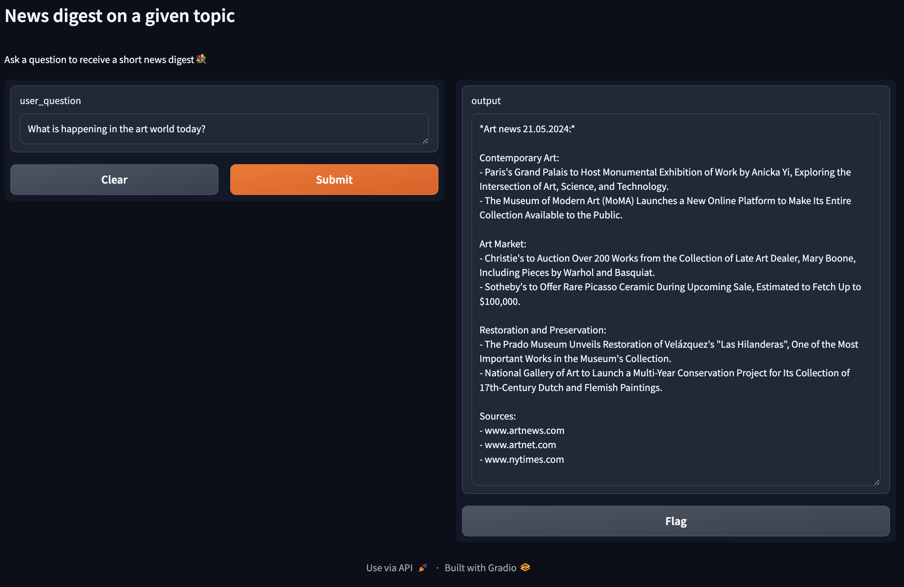

# Multiagen system for news retrieval on a gievn topic

## Setup

1. Python

    Make sure Python is installed on your system

2. Setting up environment

    Execute the following lines in the terminal to switch to your project folder (change path to the path to your local project directory) and create virtual environment:

    `cd path/to/project/folder`

    `python -m venv news_retrieval_multiagent_system_venv`

    To deactivate the virtual environment, simply run the following line in the terminal:

    `deactivate`

3. Install the required packages with the following line:

    `pip install -r requirements.txt`

4. Setting up Environment Variables

    - In the root directory of your project, create a file named `.env`.
    - Add your credentials

        Open the .env file in a text editor and add your API keys:

        ```
        GROQ_API_KEY='your_groq_api_key_here'
        SERPER_API_KEY='your_serper_api_key_here'
        ```

5. To run multiagent system, run the corresponding file with:

    `python multiagent_system.py`

    You will get private/public gradio url, where you will be able to test the model using simple ui.


## Structure

### Scripts

- [multiagent_system.py](multiagent_system.py) - Script for initializing and running the multiagent system on local/public gradio url.
- [tools.py](tools.py) - Script with tools, used by LLM. Contains tool for url retrieval from Serper API and scraping the retrieved pages.

### Configs

- [configs/model_config.py](configs/model_config.py) - config file for specifying the model config (in this case: name and base url)

### Notebooks

- [multiagent_system.ipynb](multiagent_system.ipynb) - constructing the multiagent system, tools and testing with chat history and results visualization.

### Results

- [images](images) folder contains screenshots of test question with result responses, asked through gradio ui

## Results example

